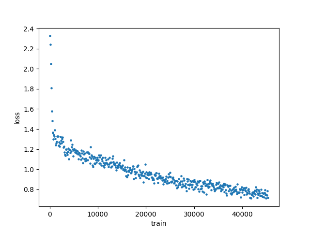

## Korean intelligence toolkit (WIP)

Generates report from Korean texts, using NLP. 

### Features

#### Segmentation


### Models 
Parameter tuning can be applied

#### BERT
(hidden_size = 192)
```
[Evaluation result]
global_step = 100000
loss = 10.826917
masked_lm_accuracy = 0.035499398
masked_lm_loss = 10.087056
next_sentence_accuracy = 0.53
next_sentence_loss = 0.69253767
```

#### NER

AdamWeightDecay, SparseCategoricalCrossentropy.



```
Analysis example : (From "담론과 진실" discours et vérité: précédé de la parrêsia, Michel Foucault)
Time : 앞서, 것과, 관점에서, 오늘은, 구절은, 이, 니코
Number : 한, 번, 제가, 바로, 모두, 여인들, 네, 번째, 첫, 여기서, 언제나, 7, 10, 처음으로, 파레시아, 24, 플라톤, 30, 들어, 아주, 분명히, 이, 다시, 크, 크레, 아마, 또, 가, 자신을
Location : 앙리, 이러한, ***, 이것은, 파레시아, 도시국가, 졸리, 들리지, M, Foucault, 통치, 타자, 더, 방식으로, 35, 세네카, 55, 다음, 파레시아스트, 많은, 아주, 문화에서, 위한, 진실, 진실을, 말하는, 그리스, 역할은, 교육자, 1983, 푸코는, 
아닌, 크레, 아무튼, 않는, 20, 아르고스, 오레스테스, 몇몇, 질문, 있으십니까, 그렇다면, 대화, 소크라테스, 이용되는, 삶의, 일상적, Is, 윤리적, D, 이, 에피, 마르쿠스, 아우렐리우스, 다른, 실제로
Person : 이, 갖는, 이러한, 아니라, 니코, 기술, 제, G, 27, 45, 확실히, 글쎄요, ****, 살펴봅시다, 이상이, 크, (, p, 관해서, 오레스테스, 교육을, 로고스, 알렉산드로스, ***, 들리지, an, 견유
Misc : 들리지, 한
Organization : 34, 투, 지난, 아테나
```

Some ideas (I will try them when I have validation standard) :
* Data augmentation by subword count 
* Backward-masked tokenizer (backward-char, forward-subchar)

### Training Dataset
Proprietary datasets 
* 10GB orthogonal korean texts
* 1GB parallel korean texts
* 0.2GB NER tagged korean texts

Public datasets
* NER tagged texts from CNU, KAIST, KMOU 

### TODO 
* NER
* Paraphraser

